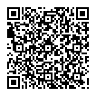

# pypercrypt 📄🔐

[](https://mypy-lang.org/)
[](./.pre-commit-config.yaml)
[](./LICENSE)
[](https://github.com/astral-sh/ruff)

`pypercrypt` uses battle-tested cryptography to encrypt your data with the passphrase of your choice
and stores the ciphertext inside a QR code.

```bash
pypercrypt encrypt --input-file keep-secret.txt --output-file ciphertext.json
# Enter passphrase: password
cat ciphertext.json
# {"ciphertext": "gAAAAABlQCb4fKNgX3xI1LHowFUjjXhOf-83DeUgukyUAYAF-hMnQ9eFfNl_V4NBoUuu4ZfAAIkVxIM7Iq2Pfh5JaVW_E-rqXA==", "salt": "JAVWUmK_PSUbvEghki3nNQ=="}
cat ciphertext.json | qrencode -o ciphertext.png
# In future versions, you'll be able to output the QR code directly
```



Now you can store the printed QR code wherever you would trust other encrypted data to stay safe.

# Benefits

- 🔐 Makes encrypted long-term storage easy
- 📵 Truly offline backups
- 🖨️ Use what you already have
- 🔓 No lock-in, no proprietary formats—you don't need this tool to decrypt your data!

# Peer-Review

A peer review is pending, so keep that in mind when using `pypercrypt` for truly sensitive data.
Get in touch if you have the required expertise to review this tool.

# Roadmap

## Now

- [x] Encrypt input data and write ciphertext to file
- [ ] Add option to output ciphertext as a printable QR code
- [x] Decrypt the data, relying on an external QR code scanner like `zbarimg`
- [ ] Reach 100 % test coverage of the critical code paths before adding new features

## Next

- [ ] Decrypt the data straight from an image file containing a QR code
- [ ] Instructions on how to decrypt the data purely with standard tools
- [ ] Maintain 100 % test-coverage of the critical code paths
- [ ] Release v1.0 (until then the CLI and format may be subject to breaking changes)

## Later

- Let relevant experts perform an audit of this software
- Keep `pypercrypt` small and auditable by anyone
- A small scope is a feature
- Resist temptation to add more features

## Never

The following features will never be added to `pypercrypt`, either because they go against its goals or would
make the scope too large.

- Do not generate passphrases for the user
- Do not add asymmetric encryption support
- Do not add a GUI or TUI (if I can't resist, then do it as a separate project using `pypercrypt` as a library)

# Alternatives

- [`papercrypt`](https://github.com/TMUniversal/papercrypt) fulfills a similar purpose, is written in Go and
  not affiliated with this project

# License

Licensed under the EUPL. See [LICENSE](./LICENSE).
